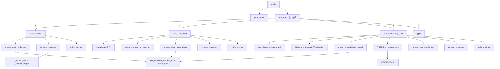

# LLM Tests
> Agent coding: github copilot - auto

PRD 요구사항에 따라 OpenAI 호환 프록시 서버를 대상으로 텍스트/비전/임베딩(RAG) 테스트를 수행하는 CLI 프로그램입니다.

## 1) 실행 환경
- Python 3.14.x
- 가상환경: `.venv`

## 2) 설치
```bash
pip install -r requirements.txt
```

## 3) 환경 변수
`.env` 파일에 아래 값을 설정합니다.

```env
API_KEY=your_api_key
BASE_URL=http://your-proxy-host/v1
```

모델명은 코드에서 아래와 같이 고정되어 있습니다.
- text 테스트: `text`
- vision 테스트: `vision`
- embedding 테스트: `text-embedding-nomic-embed-text-v1.5`
- RAG 답변 생성: `text`

## 4) 실행
```bash
python main.py
```

## 5) 메뉴
1. text 모델 테스트
2. image(vision) 모델 테스트 (`sample.jpg` 자동 사용)
3. embedding 모델 테스트 (RAG)
4. 종료

## 6) 출력
- 모델 응답은 스트리밍 텍스트로 출력
- 응답 종료 후 아래 메트릭 출력
  - 입력 토큰 수
  - 출력 토큰 수
  - TTFT (Time To First Token)
  - TPS (Tokens Per Second)

## 7) 파일 입력
- RAG 테스트 파일: `.txt`, `.pdf` 지원
- 예시 파일: `sample.txt`, `sample.pdf`

## 8) 소스 구조와 함수 호출 관계

프로그램의 진입점은 `main()`이며, 메뉴 선택에 따라 각 테스트 함수가 분기 호출됩니다.



핵심 유틸 함수 역할:
- `get_required_env`: 필수 환경 변수 검증
- `ask_input`: 공통 사용자 입력 처리
- `stream_response`: 스트리밍 출력 + TTFT/TPS 측정
- `print_metrics`: 토큰/성능 메트릭 출력

## 9) 함수 호출 관계 (텍스트 박스 버전)

아래 다이어그램은 Mermaid 렌더링 없이도 흐름을 한눈에 볼 수 있도록 동일한 내용을 텍스트 박스로 표현한 버전입니다.

```text
+--------------------+
|       main         |
+--------------------+
       |
       v
+--------------------+        +--------------------------+
|     print_menu     |<-------|    while True loop       |
+--------------------+        +--------------------------+
       |
       v
+--------------------+
| ask_input(메뉴선택) |
+--------------------+
  |            |             |
  | 1          | 2           | 3
  v            v             v
+-------------------+  +-------------------+  +----------------------+
|   run_text_test   |  |  run_vision_test  |  |  run_embedding_test  |
+-------------------+  +-------------------+  +----------------------+
  |                         |                          |
  v                         v                          v
+----------------------+  +-------------------------+  +----------------------+
| create_chat_model    |  | sample.jpg 존재 확인    |  | load_documents       |
| (text)               |  +-------------------------+  +----------------------+
+----------------------+             |                 +----------------------+
  |                                 v                 | RecursiveCharacter... |
  v                      +-------------------------+  +----------------------+
+----------------------+   | encode_image_to_data... |  +----------------------+
| stream_response      |   +-------------------------+  | create_embeddings... |
|  - _extract_text     |             |                 +----------------------+
|  - _extract_usage    |             v                 +----------------------+
+----------------------+   +-------------------------+  | FAISS.from_documents |
  |                      | create_chat_model(vision)| +----------------------+
  v                      +-------------------------+  +----------------------+
+----------------------+             |                 | retriever.invoke     |
|   print_metrics      |             v                 +----------------------+
+----------------------+   +-------------------------+  +----------------------+
                  |    stream_response      |  | create_chat_model    |
                  +-------------------------+  | (text, 답변 생성)    |
                           |               +----------------------+
                           v                          |
                  +-------------------------+             v
                  |      print_metrics      |  +----------------------+
                  +-------------------------+  |   stream_response     |
                                      +----------------------+
                                              |
                                              v
                                      +----------------------+
                                      |    print_metrics     |
                                      +----------------------+

공통 의존(환경 변수)
+------------------------------+
| get_required_env(API_KEY)    |
| get_required_env(BASE_URL)   |
+------------------------------+
      ^              ^
      |              |
  create_chat_model  create_embeddings_model
```


